# H7_RM 快速上手

用 30～60 分钟走完这条路径：先看图 → 保持默认配置构建 → 找到 ControlTask → 跟一条命令。
以 `RoboMaster_H7` 的 **SingleBoard** 为阅读起点；双板差异最后再看 Transport reference。

## 1. 先看这张图



[打开交互版](Assets/Architecture/H7_RM_GettingStarted.html)，按「机器人控制 / 姿态 / 在线监控」切换关注范围。
图中两处 Gimbal 是同一个云台应用，分别展示命令输入和姿态输入。

实线展示现有接口调用链，不代表默认构建已驱动电机：SingleBoard 的 Gimbal、Chassis、Shoot 硬件开关默认均为 OFF。
Remote 已接 UART5 S.BUS，当前只映射底盘；云台/发射通道尚未接入。
Vision / VTM 虚线表示待接入 Input 的适配器。Referee / VTM 的设备解析与 Daemon 入口需要显式 Init，默认不绑定 UART；BoardTransport 用于双板。

## 2. 先记住五句话

- **Task = 什么时候运行。** 安排初始化顺序与周期，不写完整业务。
- **Application = 机器人要做什么。** 仲裁目标、切换模式、计算控制量。
- **Device = 设备怎么工作。** 封装协议、反馈和设备操作。
- **System / Message Center = 模块共享的数据与系统服务。** 包括 INS 状态、消息、在线检测和板间 Transport。
- **BSP = MCU 怎么收发数据。** 管理 CAN/UART/SPI、缓冲与回调。

## 3. 第一次只看这些文件

建议按表顺序阅读，先找入口函数，不逐行读完所有驱动。

| 入口 | 为什么看 |
| --- | --- |
| [Control_Task.cpp](User_File/Task/Control_Task.cpp) | 找到 `Control_Task`：High1、1 kHz，按 Input → RobotCmd → Gimbal/Chassis/Shoot 顺序运行。 |
| [RobotCmd.cpp](User_File/Application/RobotCmd/RobotCmd.cpp) | 看输入仲裁、输出许可和命令发布，理解命令为什么有唯一所有者。 |
| [Gimbal.cpp](User_File/Application/Gimbal/Gimbal.cpp) | 看 Application 怎样读取命令/INS、检查设备 Ready，再控制自己拥有的电机。 |
| [message_types.h](User_File/System/MessageCenter/message_types.h) | 先认识 `ChassisCmd`、`INS_State`、反馈与 `ShootEvent` 的数据形状和单位。 |
| [DJImotor/](User_File/Device/Peripheral/Motor/DJImotor) | 从 [驱动文档](User_File/Device/Peripheral/Motor/DJImotor/dji_motor.md) 找 `GetMotionSnapshot()`，区分反馈新鲜度、输出许可与实际输出。 |
| [Daemon/](User_File/System/Daemon) | 从 [在线监控说明](User_File/System/Daemon/README.md) 看 Feed、Check 和状态跃迁。 |

## 4. 一条控制命令是怎么走的

```text
S.BUS（UART5，Device 解析完整帧）
  → RemoteInput_Update（读取帧快照、互锁、转换单位）
  → InputState（保存固定来源状态）
  → RobotCmd_Update（仲裁，发布 ChassisCmd）
  → Chassis_Command_Topic（Message Center）
  → Chassis_Update（读取目标，计算底盘运动学）
  → DJIMotor / Group（生成设备控制帧）
  → CAN BSP（最新周期槽）
  → CanTxTask 1 kHz → HAL → CAN 总线
```

沿着 [remote_input.cpp](User_File/Application/Input/remote_input.cpp) 与 RobotCmd 阅读即可。
InputState 是固定输入状态，命令 Topic 是跨模块通道，两者职责不同。
ControlTask 以 1 kHz 调度，但 RobotCmd 的底盘命令每 10 ms 刷新；调度频率不等于消息发布频率。
设备反馈反向回到 Application，机构再发布 Feedback Topic 给 RobotCmd。
双板时底盘命令经过固定 Transport，进入底盘板本地 Topic，见 [Transport](User_File/System/Transport/README.md)。

## 5. 姿态是怎么走的

```text
BMI088 → SPI DMA / FIFO → BMI088_Task（High2，事件驱动）
  → VQF 逐帧解算 → System_IMU_Publish_State
  → INS_State_Topic → Gimbal（ControlTask 内读取）
```

[BMI088_Task.cpp](User_File/Task/BMI088_Task.cpp) 被回调线程标志唤醒后清空约 2 kHz gyro FIFO 样本，再发布本批最新姿态。
它不是固定周期 2 kHz 任务；[InsTask.cpp](User_File/Task/InsTask.cpp) 已直接退出，不承担姿态解算。
Gimbal 使用 10 ms 新鲜度检查；具体坐标系、单位和控制条件见 [云台 reference](User_File/Application/Gimbal/README.md)。

## 6. Daemon 是干什么的

合法周期数据到达 → 设备/系统调用 `Daemon::Feed()`；
[StatusTask](User_File/Task/StatusTask.cpp) 以 Low 优先级、100 Hz 调用 `DaemonManager::CheckAll()` → 记录在线/离线跃迁。

**Daemon = liveness（活性）**：判断在线、离线、离线时长与 Transition。
急停、电机控制和整车安全策略由拥有设备的 Application 决定。
在线只证明数据源活跃；例如合法的 S.BUS failsafe 帧仍可 Feed，控制许可还要检查失控标志与新鲜度。
StatusTask 同时提供 DM 协议状态服务，这不属于 Daemon 的控制职责。

## 7. Topic 和 EventQueue

连续状态和目标 → `Topic<T>`：只关心最新值；离散不可覆盖动作 → `EventQueue<T,N>`：成功入队的动作按 FIFO 消费。
例如姿态和底盘速度走 Topic，单发/三连发动作走 EventQueue。
需要写接口时再看 [Message Center reference](User_File/System/MessageCenter/README.md)，这里先记住数据语义。

## 8. 新人第一个练习

**保持默认硬件开关关闭，构建一次并找到控制链。** 不需要让电机转动，也不需要修改业务参数。

1. 准备 CMake 3.22+、Ninja 和 PATH 中的 GNU Arm 工具链；完整环境与烧录入口见 [构建与调试](README.md#构建与调试)。
2. 在仓库根目录运行：

   ```sh
   cmake --preset SingleBoard
   cmake --build --preset SingleBoard
   ```

3. 在 `build/SingleBoard/CMakeCache.txt` 确认 `H7_APP_GIMBAL`、`H7_APP_CHASSIS`、`H7_APP_SHOOT` 均为 OFF，找到同目录的 `H7_BSP.elf` / `H7_BSP.map`。
4. 打开 Control_Task.cpp，找到 RemoteInput、RobotCmd 和三个 Application 的 Update；沿着第 4 节定位 `Chassis_Command_Topic` 的发布者与消费者。
5. 在 DJI 文档和 [dji_motor.h](User_File/Device/Peripheral/Motor/DJImotor/dji_motor.h) 中找到运动快照，说明角度 `rad`、速度 `rad/s`、时间戳和 `online` 分别表示什么。

完成标准：能构建出 ELF，能指认 Task、命令发布者、Topic、设备反馈入口。
没有工具链时先完成代码阅读部分。烧录前按根 README 核对探针与目标板；实车启用电机前按各模块 reference 核对接线、方向与标定。

## 9. 下一步看哪里

| 想做什么 | Reference |
| --- | --- |
| 写机器人逻辑 | [Application 开发指南](User_File/Application/README.md) |
| 接 CAN / UART | [BSP 开发指南](User_File/Middleware/BSP/README.md) |
| 加 Motor | [DJI](User_File/Device/Peripheral/Motor/DJImotor/dji_motor.md) / [DM](User_File/Device/Peripheral/Motor/DMmotor/dmmotor.md) |
| 模块间传数据 | [Message Center](User_File/System/MessageCenter/README.md) |
| 做在线监控 | [Daemon](User_File/System/Daemon/README.md) |
| 理解双板 | [Transport](User_File/System/Transport/README.md) |
| 接遥控器 | [Remote](User_File/Device/Peripheral/Remote/README.md) |
| 看完整工程分层 | [总览图](Assets/Architecture/H7_BSP.svg) / [交互版](Assets/Architecture/H7_BSP.html) |

学习路径：Level 0 会构建、找到 ControlTask，再按根 README 烧录与观察；Level 1 会读 Config 和 Motor Snapshot；Level 2 会接 Topic/EventQueue、Device 和 Daemon；Level 3 会写 Application 的 `Init → Read → Mode → Calculate → Device → Publish`。

两张图都维护 JSON 图源：总览为 [H7_BSP.architecture.json](Assets/Architecture/H7_BSP.architecture.json)，新人图为 [H7_RM_GettingStarted.architecture.json](Assets/Architecture/H7_RM_GettingStarted.architecture.json)。
生成 SVG / HTML 的实际命令见 [README「维护架构图」](README.md#维护架构图)；生成文件随图源一起提交，不手改 SVG。
